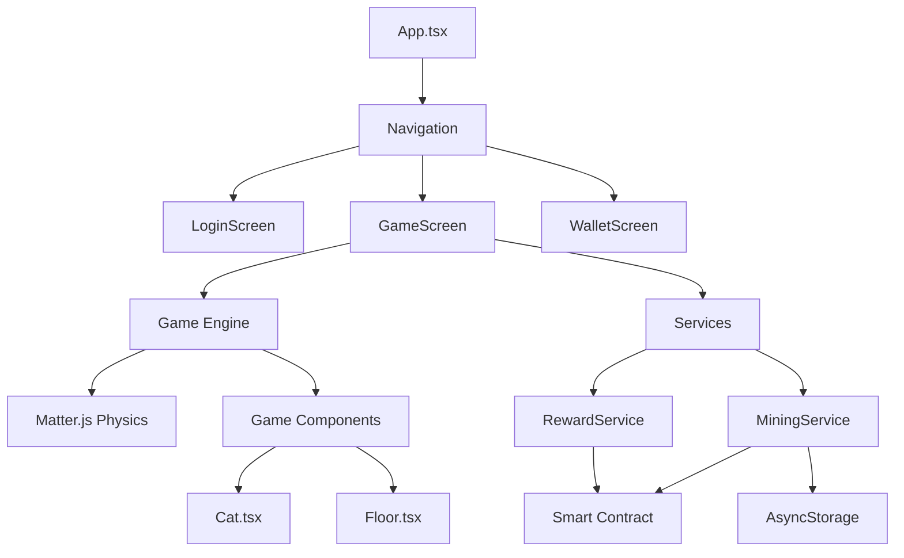
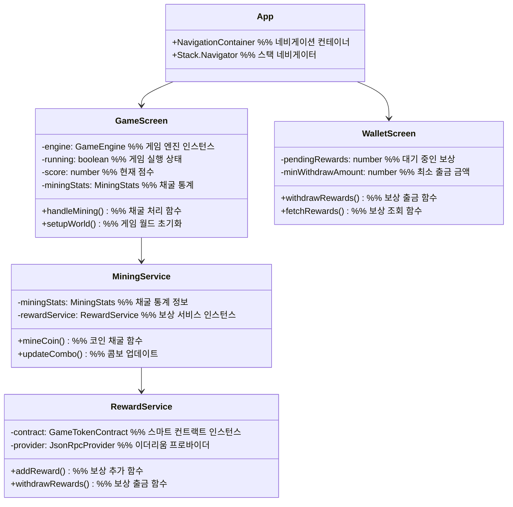
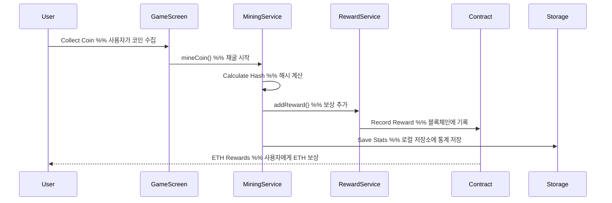
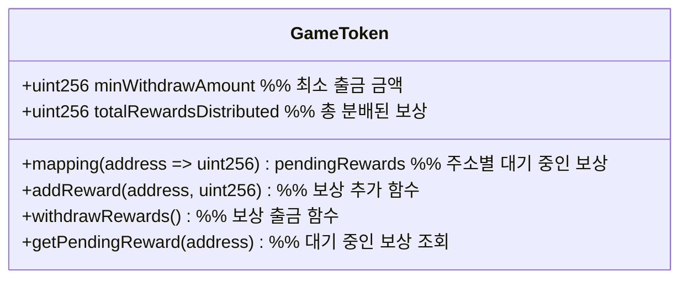
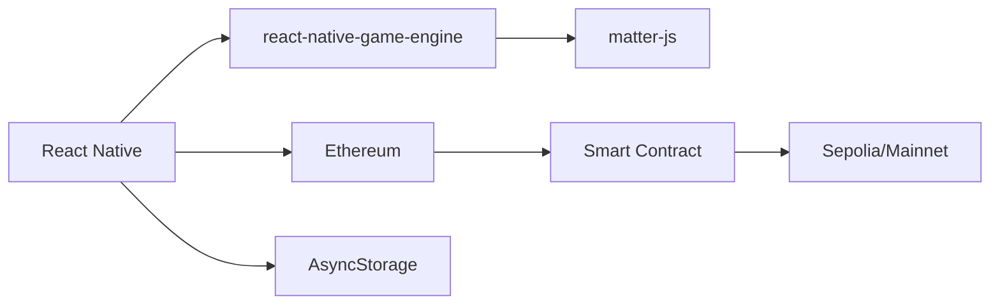

# CryptoKittyRunner Architecture

## Project Structure
// 전체 앱의 구조와 주요 컴포넌트 간의 관계를 보여주는 다이어그램



## Component Architecture
// 각 컴포넌트의 상세 구조와 관계를 보여주는 클래스 다이어그램



## Data Flow
// 게임 플레이 중 데이터의 흐름을 보여주는 시퀀스 다이어그램



## Smart Contract Structure
// 게임 토큰 스마트 컨트랙트의 구조를 보여주는 클래스 다이어그램



## Directory Structure
// 프로젝트의 파일 시스템 구조

```
CryptoKittyRunner/
├── src/                      # 소스 코드 디렉토리
│   ├── components/           # 재사용 가능한 컴포넌트
│   │   ├── Cat.tsx          # 고양이 캐릭터 컴포넌트
│   │   └── Floor.tsx        # 바닥 컴포넌트
│   ├── screens/             # 화면 컴포넌트
│   │   ├── GameScreen.tsx   # 게임 화면
│   │   ├── LoginScreen.tsx  # 로그인 화면
│   │   └── WalletScreen.tsx # 지갑 화면
│   ├── services/            # 서비스 레이어
│   │   ├── MiningService.ts # 채굴 서비스
│   │   └── RewardService.ts # 보상 서비스
│   └── types/               # 타입 정의
│       ├── contracts.d.ts   # 컨트랙트 타입
│       ├── mining.ts        # 채굴 관련 타입
│       └── navigation.ts    # 네비게이션 타입
├── contracts/               # 스마트 컨트랙트
│   └── GameToken.sol       # 게임 토큰 컨트랙트
├── App.tsx                 # 앱 진입점
└── package.json           # 프로젝트 설정
```

## Technology Stack
// 사용된 기술 스택과 그들 간의 관계를 보여주는 다이어그램



## Environment Configuration
// 환경 설정 파일의 구조를 보여주는 다이어그램

```mermaid
graph TD
    %% 환경 변수
    ENV[.env] --> Network[ETHEREUM_NETWORK]
    ENV --> Infura[INFURA_PROJECT_ID]
    ENV --> Contract[GAME_CONTRACT_ADDRESS]
    
    %% 채굴 설정
    ENV --> Mining[Mining Configuration]
    Mining --> Difficulty[MINING_DIFFICULTY]
    Mining --> Rewards[MINING_REWARDS]